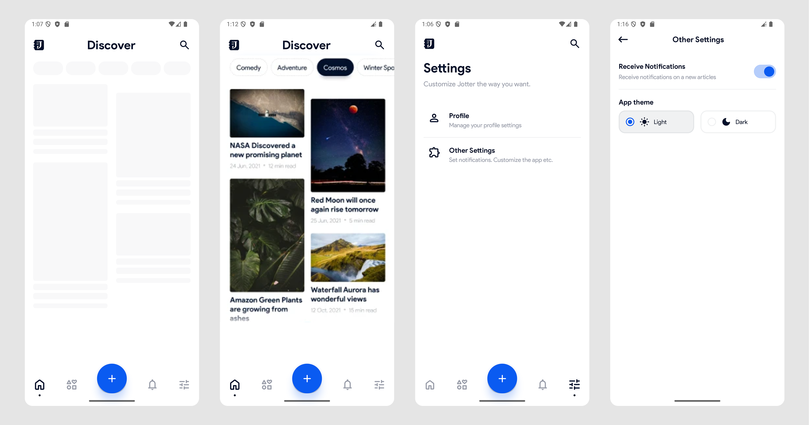
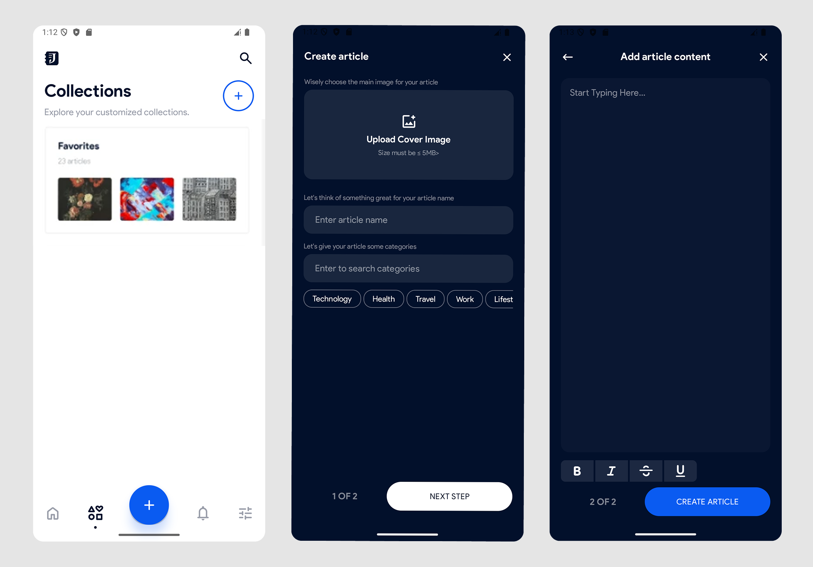

<h1 align="center">Jotter — мобильное приложение для ведения блога на Android</h1>

<p align="center">
<a href="https://github.com/Mareanexx"></a>
<a href="https://developer.android.com/jetpack/androidx/releases/compose?hl=ru"></a>
</p>
<div align="center" width="100%">
   
</div>

---

## Содержание

1. [Назначение](#назначение)
2. [Основной функционал](#основной-функционал)
3. [Описание проекта](#описание-проекта)
4. [Стек технологий](#стек-технологий)
5. [Скриншоты](#скриншоты)
6. [Установка и сборка](#установка-и-сборка)

---

## Назначение

**Jotter** — это Android-приложение для создания и ведения блога, позволяющее писать и читать статьи, управлять коллекциями статей, настраивать профиль и работать с контентом даже в оффлайн-режиме. Оно разработано с использованием современного стека технологий разработки приложений под Андроид.

---

## Основной функционал

* **✍️ Создание статей**
  Встроенный rich text-редактор с поддержкой форматирования (жирный, курсив, подчёркивание, зачёркивание), добавления обложки и выбора категорий.

* **📂 Управление коллекциями**
  Создание, переименование и удаление коллекций, добавление и удаление статей из них.

* **🔐 Аутентификация пользователей**
  Безопасная регистрация и вход в аккаунт с сохранением.

* **⚙️ Профиль и настройки**
  Изменение аватара, имени пользователя, биографии, даты рождения, переключение между светлой и тёмной темами, настройка уведомлений.

* **🌐 Оффлайн-режим**
  Кэширование данных в локальной базе **Room** с последующей синхронизацией при восстановлении соединения.

* **✨ Современный UI/UX**
  Полностью реализован на **Jetpack Compose**, с поддержкой pull-to-refresh, анимаций и skeleton-загрузки.

---

## Описание проекта

Архитектура проекта построена по принципам **Clean Architecture** с разделением на независимые модули.

* **Domain Layer** — бизнес-логика и use-case’ы.
* **Data Layer** — работа с Room, Retrofit, DTO и маппингом данных.
* **Presentation Layer** — интерфейс на Jetpack Compose, `ViewModel` и управление состоянием через `StateFlow`.

Все зависимости внедряются с помощью **Hilt**.
Сетевое взаимодействие реализовано через **Retrofit**, асинхронная обработка — с помощью **Coroutines** и **Flow**.
Приложение обрабатывает ошибки централизованно и корректно отменяет фоновые задачи при смене экранов.

---

## Стек технологий

* **Язык**: Kotlin
* **UI**: Jetpack Compose
* **Архитектура**: Clean Architecture, multi-module (по фичам)
* **DI**: Hilt
* **Асинхронность**: Kotlin Coroutines & Flow
* **Сеть**: Retrofit & Gson
* **БД**: Room
* **Навигация**: Jetpack Navigation Compose
* **Загрузка изображений**: Coil 3
* **Редактор текста**: Rich-Editor-Compose

---

## Скриншоты




---

## Установка и сборка

1. Клонируйте репозиторий:

   ```bash
   git clone https://github.com/mareanexx/jotter-blog-app.git
   ```
2. Откройте проект в **Android Studio**.
3. **Бэкенд**: Приложение требует запущенного локального сервера.
   Для полной работоспособности необходимо развернуть соответствующий [бекенд](https://github.com/Mareanexx/jotter-backend).
4. Соберите и запустите проект на эмуляторе или физическом устройстве.